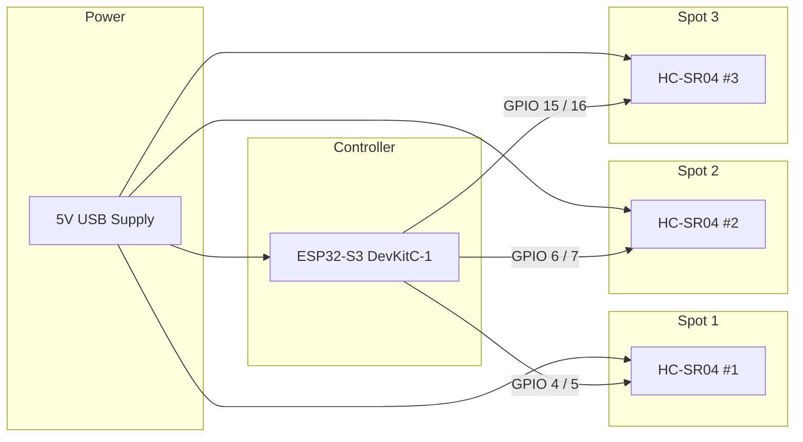
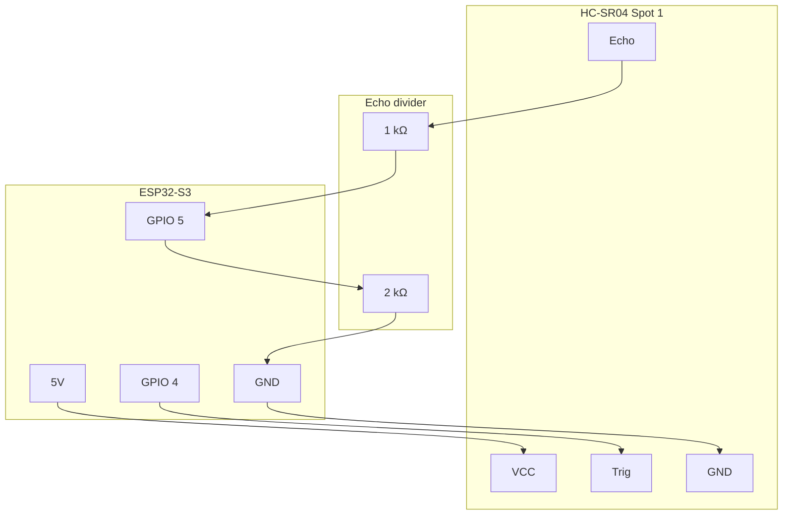

# PerfectPark Wiring Diagram

This guide covers the default **3-spot** wiring for an **ESP32-S3 DevKitC-1** and
**HC-SR04** ultrasonic sensors. The 2-spot build uses the same pattern for Spot 1
and Spot 2 only.

## System overview

Each parking spot uses one HC-SR04. The ESP32-S3 reads distance over GPIO, joins
your home WiFi, and serves the web dashboard.



## Physical layout

Mount one sensor per bay on the **rear wall**, at **bumper height**, facing the
direction the car drives in.

```
Garage rear wall
┌─────────────────────────────────────────────────────────────┐
│                                                             │
│   [HC-SR04 #1]         [HC-SR04 #2]         [HC-SR04 #3]    │
│       │                     │                     │         │
│       ▼                     ▼                     ▼         │
│    Spot 1                Spot 2                Spot 3       │
│   ◄─ car ─►              ◄─ car ─►              ◄─ car ─►   │
│                                                             │
│   ┌──────────┐                                              │
│   │ ESP32-S3 │  (mount nearby; USB power)                   │
│   └──────────┘                                              │
└─────────────────────────────────────────────────────────────┘
```

Target distances:

- **Detect vehicle:** up to ~7 ft (~213 cm)
- **Parked target:** ~3 ft (~91 cm) from sensor to bumper

---

## Pin map

| Spot | HC-SR04 pin | Connect to |
|------|-------------|------------|
| 1 | VCC | 5V |
| 1 | GND | GND |
| 1 | Trig | ESP32 **GPIO 4** |
| 1 | Echo | Voltage divider output → ESP32 **GPIO 5** |
| 2 | VCC | 5V |
| 2 | GND | GND |
| 2 | Trig | ESP32 **GPIO 6** |
| 2 | Echo | Voltage divider output → ESP32 **GPIO 7** |
| 3 | VCC | 5V |
| 3 | GND | GND |
| 3 | Trig | ESP32 **GPIO 15** |
| 3 | Echo | Voltage divider output → ESP32 **GPIO 16** |

All spots share a common **GND** rail. Run **5V** and **GND** from the same supply
that powers the ESP32-S3 board.

---

## Echo pin voltage divider (required)

HC-SR04 **Echo** outputs **5 V**. ESP32-S3 GPIO is **3.3 V** only. Use one divider
per sensor before the Echo signal reaches the ESP32.


ASCII equivalent:

```
HC-SR04 Echo ────[ 1 kΩ ]────┬──── ESP32 Echo GPIO
                             │
                           [ 2 kΩ ]
                             │
                            GND
```

Expected voltage at the ESP32 pin: ~3.3 V when Echo is high.

**Do not** connect Echo directly to the ESP32 without a divider or logic level shifter.

---

## Per-sensor wiring diagram

Repeat this block once per spot. Example shown for **Spot 1**:



### Spot 2 and Spot 3

| Spot | Trig → GPIO | Echo → divider → GPIO |
|------|-------------|------------------------|
| 2 | GPIO 6 | GPIO 7 |
| 3 | GPIO 15 | GPIO 16 |

---

## Breadboard wiring (recommended for v1)

```
                    ESP32-S3 DevKitC-1
                 ┌───────────────────────┐
      5V rail ───┤ 5V                    │
     GND rail ───┤ GND                   │
                 │ GPIO 4  ──────────────┼──► Spot 1 Trig
                 │ GPIO 5  ◄─────────────┼───  Spot 1 Echo (via divider)
                 │ GPIO 6  ──────────────┼──► Spot 2 Trig
                 │ GPIO 7  ◄─────────────┼───  Spot 2 Echo (via divider)
                 │ GPIO 15 ──────────────┼──► Spot 3 Trig
                 │ GPIO 16 ◄─────────────┼───  Spot 3 Echo (via divider)
                 └───────────────────────┘
                          │      │
                       5V rail  GND rail
                          │      │
            ┌─────────────┴──────┴─────────────┐
            │  HC-SR04   HC-SR04   HC-SR04    │
            │  Spot 1    Spot 2    Spot 3     │
            └────────────────────────────────┘
```

Use a breadboard power rail for shared 5V/GND. Keep Trigger wires short and route
Echo lines away from USB/power noise when possible.

---

## Power notes

| Topic | Guidance |
|-------|----------|
| Supply | Use a stable **5 V / 1 A+** USB adapter |
| ESP32-S3 | Powered via USB; onboard regulator supplies 3.3 V logic |
| HC-SR04 | Each sensor draws a few mA active; 3 sensors on one 5V rail is fine |
| Ground | Tie **all** sensor GND pins and ESP32 GND together |

If sensors behave erratically at longer cable runs, add a **100 nF** decoupling
capacitor between VCC and GND at each HC-SR04 module.

---

## Bill of materials

| Part | Qty (3-spot) |
|------|----------------|
| ESP32-S3 DevKitC-1 | 1 |
| HC-SR04 | 3 |
| 1 kΩ resistor | 3 |
| 2 kΩ resistor | 3 |
| Breadboard | 1 |
| Jumper wires | 1 set |
| 5 V USB cable + adapter | 1 |

---

## Custom GPIO pins

To change pins, edit `firmware-arduino/include/config.h` and update this diagram
to match. Avoid strapping pins and USB/JTAG pins reserved by your specific
DevKit board revision.

## Related docs

- [README](../README.md) — build, flash, and API overview
- [config.h](../firmware-arduino/include/config.h) — pin and distance thresholds
